# biobricks-tox21

## Schema Diagram

```mermaid
erDiagram
OwlAllDifferent {

}
OwlAllDisjointClasses {

}
OwlAllDisjointProperties {

}
OwlAnnotation {

}
OwlAnnotationProperty {

}
OwlAsymmetricProperty {

}
OwlAxiom {

}
OwlClass {

}
OwlDataRange {
    uri rdfs_seeAlso  
    string rdfs_label  
    string rdfs_comment  
}
OwlDatatypeProperty {

}
OwlDeprecatedClass {

}
OwlDeprecatedProperty {

}
OwlFunctionalProperty {

}
OwlInverseFunctionalProperty {

}
OwlIrreflexiveProperty {

}
OwlNamedIndividual {

}
OwlNegativePropertyAssertion {

}
OwlNothing {

}
OwlObjectProperty {

}
OwlOntology {

}
OwlOntologyProperty {

}
OwlReflexiveProperty {

}
OwlRestriction {

}
OwlSymmetricProperty {

}
OwlThing {

}
OwlTransitiveProperty {

}
RdfAlt {

}
RdfBag {

}
RdfCompoundLiteral {

}
RdfList {
    string rdfs_label  
    string rdfs_comment  
}
RdfProperty {

}
RdfSeq {

}
RdfStatement {

}
RdfsClass {

}
RdfsContainer {

}
RdfsContainerMembershipProperty {

}
RdfsDatatype {
    uri rdfs_seeAlso  
    string rdfs_label  
    string rdfs_comment  
}
RdfsLiteral {

}
RdfsResource {

}
DcamVocabularyEncodingScheme {
    date dct_issued  
    string rdfs_label  
    string rdfs_comment  
    uri rdfs_seeAlso  
}
DcmitypeCollection {

}
DcmitypeDataset {

}
DcmitypeEvent {

}
DcmitypeImage {

}
DcmitypeInteractiveResource {

}
DcmitypeMovingImage {

}
DcmitypePhysicalObject {

}
DcmitypeService {

}
DcmitypeSoftware {

}
DcmitypeSound {

}
DcmitypeStillImage {

}
DcmitypeText {

}
DctAgent {

}
DctAgentClass {
    string rdfs_label  
    string rdfs_comment  
    date dct_issued  
}
DctBibliographicResource {

}
DctFileFormat {

}
DctFrequency {

}
DctJurisdiction {

}
DctLicenseDocument {

}
DctLinguisticSystem {

}
DctLocation {

}
DctLocationPeriodOrJurisdiction {

}
DctMediaType {

}
DctMediaTypeOrExtent {

}
DctMethodOfAccrual {

}
DctMethodOfInstruction {

}
DctPeriodOfTime {

}
DctPhysicalMedium {

}
DctPhysicalResource {

}
DctPolicy {

}
DctProvenanceStatement {

}
DctRightsStatement {

}
DctSizeOrDuration {

}
DctStandard {

}
OboCHEMINF000446 {
    string rdfs_label  
}

OwlDataRange ||--|o OwlOntology : "rdfs_isDefinedBy"
OwlDataRange ||--|o RdfsResource : "rdfs_isDefinedBy"
OwlDataRange ||--|o RdfsClass : "rdfs_subClassOf"
OwlDataRange ||--|o RdfsResource : "rdfs_seeAlso"
OwlDataRange ||--|o RdfsLiteral : "rdfs_label"
OwlDataRange ||--|o RdfsLiteral : "rdfs_comment"
RdfList ||--|o RdfsLiteral : "rdfs_label"
RdfList ||--|o RdfsLiteral : "rdfs_comment"
RdfList ||--|o OwlOntology : "rdfs_isDefinedBy"
RdfList ||--|o RdfsResource : "rdfs_isDefinedBy"
RdfsDatatype ||--|o OwlOntology : "rdfs_isDefinedBy"
RdfsDatatype ||--|o RdfsResource : "rdfs_isDefinedBy"
RdfsDatatype ||--|o RdfsClass : "rdfs_subClassOf"
RdfsDatatype ||--|o RdfsResource : "rdfs_seeAlso"
RdfsDatatype ||--|o RdfsLiteral : "rdfs_label"
RdfsDatatype ||--|o RdfsLiteral : "rdfs_comment"
DcamVocabularyEncodingScheme ||--|o RdfsLiteral : "dct_issued"
DcamVocabularyEncodingScheme ||--|o RdfsLiteral : "rdfs_label"
DcamVocabularyEncodingScheme ||--|o RdfsLiteral : "rdfs_comment"
DcamVocabularyEncodingScheme ||--|o RdfsResource : "rdfs_seeAlso"
DcamVocabularyEncodingScheme ||--|o OwlOntology : "rdfs_isDefinedBy"
DcamVocabularyEncodingScheme ||--|o RdfsResource : "rdfs_isDefinedBy"
DctAgentClass ||--|o RdfsLiteral : "rdfs_label"
DctAgentClass ||--|o RdfsLiteral : "rdfs_comment"
DctAgentClass ||--|o RdfsLiteral : "dct_issued"
DctAgentClass ||--|o OwlOntology : "rdfs_isDefinedBy"
DctAgentClass ||--|o RdfsResource : "rdfs_isDefinedBy"
OboCHEMINF000446 ||--|o RdfsLiteral : "rdfs_label"

```

## Imports

* okns:owl-rdf-rdfs
* linkml:types
* okns:dc

## Classes

| Class | Description | Occurrences |
| --- | --- | --- |
| [OboCHEMINF000446](https://github.com/frink-okn/graph-descriptions/blob/main/biobricks-tox21-kg/classes/OboCHEMINF000446.md) | None | 8947 | 

## IRI prefixes

* dc: http://purl.org/dc/elements/1.1/
* linkml: https://w3id.org/linkml/
* obo: http://purl.obolibrary.org/obo/
* okn: https://purl.org/okn/
* okns: https://purl.org/okn/schema/
* rdfs: http://www.w3.org/2000/01/rdf-schema#
