# identifier-mappings

## Schema Diagram

```mermaid
erDiagram
OwlAllDifferent {

}
OwlAllDisjointClasses {

}
OwlAllDisjointProperties {

}
OwlAnnotation {

}
OwlAnnotationProperty {

}
OwlAsymmetricProperty {

}
OwlAxiom {

}
OwlClass {

}
OwlDataRange {
    uri rdfs_seeAlso  
    string rdfs_label  
    string rdfs_comment  
}
OwlDatatypeProperty {

}
OwlDeprecatedClass {

}
OwlDeprecatedProperty {

}
OwlFunctionalProperty {

}
OwlInverseFunctionalProperty {

}
OwlIrreflexiveProperty {

}
OwlNamedIndividual {

}
OwlNegativePropertyAssertion {

}
OwlNothing {

}
OwlObjectProperty {

}
OwlOntology {

}
OwlOntologyProperty {

}
OwlReflexiveProperty {

}
OwlRestriction {

}
OwlSymmetricProperty {

}
OwlThing {

}
OwlTransitiveProperty {

}
RdfAlt {

}
RdfBag {

}
RdfCompoundLiteral {

}
RdfList {
    string rdfs_label  
    string rdfs_comment  
}
RdfProperty {

}
RdfSeq {

}
RdfStatement {

}
RdfsClass {

}
RdfsContainer {

}
RdfsContainerMembershipProperty {

}
RdfsDatatype {
    uri rdfs_seeAlso  
    string rdfs_label  
    string rdfs_comment  
}
RdfsLiteral {

}
RdfsResource {

}
SkosCollection {

}
SkosConcept {

}
SkosConceptScheme {

}
SkosOrderedCollection {

}

OwlDataRange ||--|o OwlOntology : "rdfs_isDefinedBy"
OwlDataRange ||--|o RdfsResource : "rdfs_isDefinedBy"
OwlDataRange ||--|o RdfsClass : "rdfs_subClassOf"
OwlDataRange ||--|o RdfsResource : "rdfs_seeAlso"
OwlDataRange ||--|o RdfsLiteral : "rdfs_label"
OwlDataRange ||--|o RdfsLiteral : "rdfs_comment"
RdfList ||--|o RdfsLiteral : "rdfs_label"
RdfList ||--|o RdfsLiteral : "rdfs_comment"
RdfList ||--|o OwlOntology : "rdfs_isDefinedBy"
RdfList ||--|o RdfsResource : "rdfs_isDefinedBy"
RdfsDatatype ||--|o OwlOntology : "rdfs_isDefinedBy"
RdfsDatatype ||--|o RdfsResource : "rdfs_isDefinedBy"
RdfsDatatype ||--|o RdfsClass : "rdfs_subClassOf"
RdfsDatatype ||--|o RdfsResource : "rdfs_seeAlso"
RdfsDatatype ||--|o RdfsLiteral : "rdfs_label"
RdfsDatatype ||--|o RdfsLiteral : "rdfs_comment"

```

## Imports

* okns:owl-rdf-rdfs
* linkml:types
* okns:skos

## IRI prefixes

* bao: http://www.bioassayontology.org/bao#BAO_
* bibo: http://purl.org/ontology/bibo/
* cidoc-crm: http://www.cidoc-crm.org/cidoc-crm/
* dc: http://purl.org/dc/elements/1.1/
* dcat: http://www.w3.org/ns/dcat#
* dcmitype: http://purl.org/dc/dcmitype/
* dct: http://purl.org/dc/terms/
* edam: http://edamontology.org/
* event: http://purl.org/NET/c4dm/event.owl#
* foaf: http://xmlns.com/foaf/0.1/
* frbr: http://purl.org/vocab/frbr/core#
* frbroo: http://iflastandards.info/ns/fr/frbr/frbroo/
* gr: http://purl.org/goodrelations/v1#
* kwgr: http://stko-kwg.geog.ucsb.edu/lod/resource/
* linkml: https://w3id.org/linkml/
* mo: http://purl.org/ontology/mo/
* obo: http://purl.obolibrary.org/obo/
* okn: https://purl.org/okn/
* okns: https://purl.org/okn/schema/
* org: http://www.w3.org/ns/org#
* owl: http://www.w3.org/2002/07/owl#
* qudt: http://qudt.org/schema/qudt/
* rdf: http://www.w3.org/1999/02/22-rdf-syntax-ns#
* rdfs: http://www.w3.org/2000/01/rdf-schema#
* sdos: https://schema.org/
* semsci: http://semanticscience.org/resource/SIO_
* skos: http://www.w3.org/2004/02/skos/core#
* time: http://www.w3.org/2006/time#
* vcard: http://www.w3.org/2006/vcard/ns#
* voag: http://voag.linkedmodel.org/voag#
* void: http://rdfs.org/ns/void#
* wd: http://www.wikidata.org/entity/
* wikibase: http://wikiba.se/ontology#
* xhv: http://www.w3.org/1999/xhtml/vocab#
