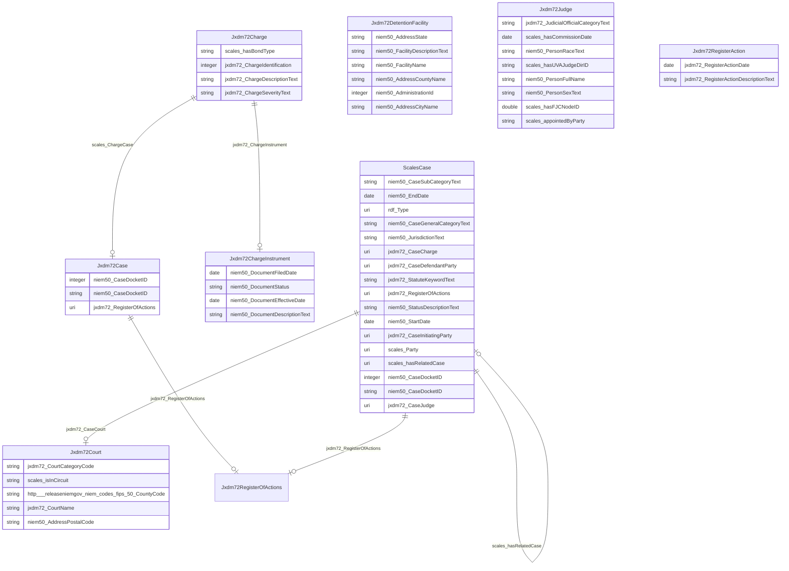

# No schema name specified

No schema description specified

## Schema Diagram

## Classes

| Class | Description |
| --- | --- |
| [Jxdm72Case](https://github.com/frink-okn/graph-descriptions/blob/main/scales-kg/classes/Jxdm72Case.md) | No class (type) description specified Class with 96011 occurrences.| 
| [Jxdm72Charge](https://github.com/frink-okn/graph-descriptions/blob/main/scales-kg/classes/Jxdm72Charge.md) | No class (type) description specified Class with 218359 occurrences.| 
| [Jxdm72ChargeInstrument](https://github.com/frink-okn/graph-descriptions/blob/main/scales-kg/classes/Jxdm72ChargeInstrument.md) | No class (type) description specified Class with 86007 occurrences.| 
| [Jxdm72Court](https://github.com/frink-okn/graph-descriptions/blob/main/scales-kg/classes/Jxdm72Court.md) | No class (type) description specified Class with 94 occurrences.| 
| [Jxdm72DetentionFacility](https://github.com/frink-okn/graph-descriptions/blob/main/scales-kg/classes/Jxdm72DetentionFacility.md) | No class (type) description specified Class with 1 occurrences.| 
| [Jxdm72Judge](https://github.com/frink-okn/graph-descriptions/blob/main/scales-kg/classes/Jxdm72Judge.md) | No class (type) description specified Class with 5385 occurrences.| 
| [Jxdm72RegisterAction](https://github.com/frink-okn/graph-descriptions/blob/main/scales-kg/classes/Jxdm72RegisterAction.md) | No class (type) description specified Class with 94929 occurrences.| 
| [Jxdm72RegisterOfActions](https://github.com/frink-okn/graph-descriptions/blob/main/scales-kg/classes/Jxdm72RegisterOfActions.md) | No class (type) description specified Class with 94929 occurrences.| 
| [ScalesCase](https://github.com/frink-okn/graph-descriptions/blob/main/scales-kg/classes/ScalesCase.md) | No class (type) description specified Class with 2 occurrences.| 

## Slots

| Slot | Description |
| --- | --- |
| [http___release.niem.gov_niem_codes_fips_5.0_#CountyCode](https://github.com/frink-okn/graph-descriptions/blob/main/scales-kg/slots/http___release.niem.gov_niem_codes_fips_5.0_#CountyCode.md) | No slot (predicate) description specified 3035 occurrences with untyped subjects and object type string.|
| [http___release.niem.gov_niem_codes_fips_5.0_CountyCode](https://github.com/frink-okn/graph-descriptions/blob/main/scales-kg/slots/http___release.niem.gov_niem_codes_fips_5.0_CountyCode.md) | No slot (predicate) description specified 3035 occurrences with subject type jxdm72_Court and object type string.|
| [http___schemas.scales_okn.org_rdf_ijp#hasFJCNodeID](https://github.com/frink-okn/graph-descriptions/blob/main/scales-kg/slots/http___schemas.scales_okn.org_rdf_ijp#hasFJCNodeID.md) | No slot (predicate) description specified 3855 occurrences with untyped subjects and object type double.|
| [http___schemas.scales_okn.org_rdf_ijp#hasUVAJudgeDirID](https://github.com/frink-okn/graph-descriptions/blob/main/scales-kg/slots/http___schemas.scales_okn.org_rdf_ijp#hasUVAJudgeDirID.md) | No slot (predicate) description specified 988 occurrences with untyped subjects and object type string.|
| [jxdm72_Attorney](https://github.com/frink-okn/graph-descriptions/blob/main/scales-kg/slots/jxdm72_Attorney.md) | No slot (predicate) description specified 386063 occurrences with untyped subjects and object type uri.|
| [jxdm72_BailBondAmount](https://github.com/frink-okn/graph-descriptions/blob/main/scales-kg/slots/jxdm72_BailBondAmount.md) | No slot (predicate) description specified 72999 occurrences with untyped subjects and object type uri.|
| [jxdm72_BailBondChargeAssociation](https://github.com/frink-okn/graph-descriptions/blob/main/scales-kg/slots/jxdm72_BailBondChargeAssociation.md) | No slot (predicate) description specified 216422 occurrences with untyped subjects and object type jxdm72_Charge.|
| [jxdm72_Case](https://github.com/frink-okn/graph-descriptions/blob/main/scales-kg/slots/jxdm72_Case.md) | No slot (predicate) description specified 266314 occurrences with untyped subjects and object type scales_Case.|
| [jxdm72_CaseCharge](https://github.com/frink-okn/graph-descriptions/blob/main/scales-kg/slots/jxdm72_CaseCharge.md) | No slot (predicate) description specified 213743 occurrences with subject type scales_Case and object type uri.|
| [jxdm72_CaseCourt](https://github.com/frink-okn/graph-descriptions/blob/main/scales-kg/slots/jxdm72_CaseCourt.md) | No slot (predicate) description specified 143 occurrences with subject type scales_Case and object type jxdm72_Court.|
| [jxdm72_CaseDefendantParty](https://github.com/frink-okn/graph-descriptions/blob/main/scales-kg/slots/jxdm72_CaseDefendantParty.md) | No slot (predicate) description specified 1852839 occurrences with subject type scales_Case and object type uri.|
| [jxdm72_CaseDefenseAttorney](https://github.com/frink-okn/graph-descriptions/blob/main/scales-kg/slots/jxdm72_CaseDefenseAttorney.md) | No slot (predicate) description specified 1890518 occurrences with untyped subjects and object type uri.|
| [jxdm72_CaseInitiatingAttorney](https://github.com/frink-okn/graph-descriptions/blob/main/scales-kg/slots/jxdm72_CaseInitiatingAttorney.md) | No slot (predicate) description specified 1854513 occurrences with untyped subjects and object type uri.|
| [jxdm72_CaseInitiatingParty](https://github.com/frink-okn/graph-descriptions/blob/main/scales-kg/slots/jxdm72_CaseInitiatingParty.md) | No slot (predicate) description specified 920509 occurrences with subject type scales_Case and object type uri.|
| [jxdm72_CaseJudge](https://github.com/frink-okn/graph-descriptions/blob/main/scales-kg/slots/jxdm72_CaseJudge.md) | No slot (predicate) description specified 837266 occurrences with subject type scales_Case and object type uri.|
| [jxdm72_CaseOfficialRoleText](https://github.com/frink-okn/graph-descriptions/blob/main/scales-kg/slots/jxdm72_CaseOfficialRoleText.md) | No slot (predicate) description specified 1119175 occurrences with untyped subjects and object type string.|
| [jxdm72_ChargeDescriptionText](https://github.com/frink-okn/graph-descriptions/blob/main/scales-kg/slots/jxdm72_ChargeDescriptionText.md) | No slot (predicate) description specified 218535 occurrences with subject type jxdm72_Charge and object type string.|
| [jxdm72_ChargeDisposition](https://github.com/frink-okn/graph-descriptions/blob/main/scales-kg/slots/jxdm72_ChargeDisposition.md) | No slot (predicate) description specified 213743 occurrences with untyped subjects and object type string.|
| [jxdm72_ChargeIdentification](https://github.com/frink-okn/graph-descriptions/blob/main/scales-kg/slots/jxdm72_ChargeIdentification.md) | No slot (predicate) description specified 218359 occurrences with subject type jxdm72_Charge and object type integer.|
| [jxdm72_ChargeInstrument](https://github.com/frink-okn/graph-descriptions/blob/main/scales-kg/slots/jxdm72_ChargeInstrument.md) | No slot (predicate) description specified 199210 occurrences with subject type jxdm72_Charge and object type jxdm72_ChargeInstrument.|
| [jxdm72_ChargeSequenceID](https://github.com/frink-okn/graph-descriptions/blob/main/scales-kg/slots/jxdm72_ChargeSequenceID.md) | No slot (predicate) description specified 213743 occurrences with untyped subjects and object type string.|
| [jxdm72_ChargeSeverityText](https://github.com/frink-okn/graph-descriptions/blob/main/scales-kg/slots/jxdm72_ChargeSeverityText.md) | No slot (predicate) description specified 218372 occurrences with subject type jxdm72_Charge and object type string.|
| [jxdm72_ChargeText](https://github.com/frink-okn/graph-descriptions/blob/main/scales-kg/slots/jxdm72_ChargeText.md) | No slot (predicate) description specified 213743 occurrences with untyped subjects and object type string.|
| [jxdm72_CourtCategoryCode](https://github.com/frink-okn/graph-descriptions/blob/main/scales-kg/slots/jxdm72_CourtCategoryCode.md) | No slot (predicate) description specified 94 occurrences with subject type jxdm72_Court and object type string. 94 occurrences with untyped subjects and object type string.|
| [jxdm72_CourtName](https://github.com/frink-okn/graph-descriptions/blob/main/scales-kg/slots/jxdm72_CourtName.md) | No slot (predicate) description specified 94 occurrences with subject type jxdm72_Court and object type string. 94 occurrences with untyped subjects and object type string.|
| [jxdm72_JudicialOfficialCategoryText](https://github.com/frink-okn/graph-descriptions/blob/main/scales-kg/slots/jxdm72_JudicialOfficialCategoryText.md) | No slot (predicate) description specified 5385 occurrences with subject type jxdm72_Judge and object type string. 5385 occurrences with untyped subjects and object type string.|
| [jxdm72_ParticipantRoleCategoryText](https://github.com/frink-okn/graph-descriptions/blob/main/scales-kg/slots/jxdm72_ParticipantRoleCategoryText.md) | No slot (predicate) description specified 2993003 occurrences with untyped subjects and object type string.|
| [jxdm72_PersonCharge](https://github.com/frink-okn/graph-descriptions/blob/main/scales-kg/slots/jxdm72_PersonCharge.md) | No slot (predicate) description specified 213743 occurrences with untyped subjects and object type uri.|
| [jxdm72_RegisterAction](https://github.com/frink-okn/graph-descriptions/blob/main/scales-kg/slots/jxdm72_RegisterAction.md) | No slot (predicate) description specified 19671603 occurrences with untyped subjects and object type uri.|
| [jxdm72_RegisterActionDate](https://github.com/frink-okn/graph-descriptions/blob/main/scales-kg/slots/jxdm72_RegisterActionDate.md) | No slot (predicate) description specified 421518 occurrences with subject type jxdm72_RegisterAction and object type date. 19671603 occurrences with untyped subjects and object type date.|
| [jxdm72_RegisterActionDescriptionText](https://github.com/frink-okn/graph-descriptions/blob/main/scales-kg/slots/jxdm72_RegisterActionDescriptionText.md) | No slot (predicate) description specified 561095 occurrences with subject type jxdm72_RegisterAction and object type string. 19671841 occurrences with untyped subjects and object type string.|
| [jxdm72_RegisterOfActions](https://github.com/frink-okn/graph-descriptions/blob/main/scales-kg/slots/jxdm72_RegisterOfActions.md) | No slot (predicate) description specified 581243 occurrences with subject type scales_Case and object type uri. 94929 occurrences with subject type jxdm72_Case and object type jxdm72_RegisterOfActions.|
| [jxdm72_StatuteKeywordText](https://github.com/frink-okn/graph-descriptions/blob/main/scales-kg/slots/jxdm72_StatuteKeywordText.md) | No slot (predicate) description specified 2680 occurrences with subject type scales_Case and object type string.|
| [niem50_#AddressPostalCode](https://github.com/frink-okn/graph-descriptions/blob/main/scales-kg/slots/niem50_#AddressPostalCode.md) | No slot (predicate) description specified 40932 occurrences with untyped subjects and object type string.|
| [niem50_AddressCityName](https://github.com/frink-okn/graph-descriptions/blob/main/scales-kg/slots/niem50_AddressCityName.md) | No slot (predicate) description specified 1 occurrences with subject type jxdm72_DetentionFacility and object type string.|
| [niem50_AddressCountyName](https://github.com/frink-okn/graph-descriptions/blob/main/scales-kg/slots/niem50_AddressCountyName.md) | No slot (predicate) description specified 1 occurrences with subject type jxdm72_DetentionFacility and object type string.|
| [niem50_AddressPostalCode](https://github.com/frink-okn/graph-descriptions/blob/main/scales-kg/slots/niem50_AddressPostalCode.md) | No slot (predicate) description specified 40932 occurrences with subject type jxdm72_Court and object type string.|
| [niem50_AddressState](https://github.com/frink-okn/graph-descriptions/blob/main/scales-kg/slots/niem50_AddressState.md) | No slot (predicate) description specified 1 occurrences with subject type jxdm72_DetentionFacility and object type string.|
| [niem50_AdministrationId](https://github.com/frink-okn/graph-descriptions/blob/main/scales-kg/slots/niem50_AdministrationId.md) | No slot (predicate) description specified 1 occurrences with subject type jxdm72_DetentionFacility and object type integer.|
| [niem50_AdministrativeID](https://github.com/frink-okn/graph-descriptions/blob/main/scales-kg/slots/niem50_AdministrativeID.md) | No slot (predicate) description specified 19671603 occurrences with untyped subjects and object type string.|
| [niem50_Amount](https://github.com/frink-okn/graph-descriptions/blob/main/scales-kg/slots/niem50_Amount.md) | No slot (predicate) description specified 73497 occurrences with untyped subjects and object type float.|
| [niem50_CaseDocketID](https://github.com/frink-okn/graph-descriptions/blob/main/scales-kg/slots/niem50_CaseDocketID.md) | No slot (predicate) description specified 272547 occurrences with subject type scales_Case and object type string. 96011 occurrences with subject type jxdm72_Case and object type integer.|
| [niem50_CaseGeneralCategoryText](https://github.com/frink-okn/graph-descriptions/blob/main/scales-kg/slots/niem50_CaseGeneralCategoryText.md) | No slot (predicate) description specified 2 occurrences with subject type scales_Case and object type string.|
| [niem50_CaseSubCategoryText](https://github.com/frink-okn/graph-descriptions/blob/main/scales-kg/slots/niem50_CaseSubCategoryText.md) | No slot (predicate) description specified 104 occurrences with subject type scales_Case and object type string.|
| [niem50_ContactMailingAddress](https://github.com/frink-okn/graph-descriptions/blob/main/scales-kg/slots/niem50_ContactMailingAddress.md) | No slot (predicate) description specified 2023829 occurrences with untyped subjects and object type string.|
| [niem50_DocumentDescriptionText](https://github.com/frink-okn/graph-descriptions/blob/main/scales-kg/slots/niem50_DocumentDescriptionText.md) | No slot (predicate) description specified 94949 occurrences with subject type jxdm72_ChargeInstrument and object type string.|
| [niem50_DocumentEffectiveDate](https://github.com/frink-okn/graph-descriptions/blob/main/scales-kg/slots/niem50_DocumentEffectiveDate.md) | No slot (predicate) description specified 92142 occurrences with subject type jxdm72_ChargeInstrument and object type date.|
| [niem50_DocumentFiledDate](https://github.com/frink-okn/graph-descriptions/blob/main/scales-kg/slots/niem50_DocumentFiledDate.md) | No slot (predicate) description specified 86007 occurrences with subject type jxdm72_ChargeInstrument and object type date.|
| [niem50_DocumentStatus](https://github.com/frink-okn/graph-descriptions/blob/main/scales-kg/slots/niem50_DocumentStatus.md) | No slot (predicate) description specified 101588 occurrences with subject type jxdm72_ChargeInstrument and object type string.|
| [niem50_EndDate](https://github.com/frink-okn/graph-descriptions/blob/main/scales-kg/slots/niem50_EndDate.md) | No slot (predicate) description specified 9629 occurrences with subject type scales_Case and object type date.|
| [niem50_EntityName](https://github.com/frink-okn/graph-descriptions/blob/main/scales-kg/slots/niem50_EntityName.md) | No slot (predicate) description specified 3004657 occurrences with untyped subjects and object type string.|
| [niem50_FacilityDescriptionText](https://github.com/frink-okn/graph-descriptions/blob/main/scales-kg/slots/niem50_FacilityDescriptionText.md) | No slot (predicate) description specified 1 occurrences with subject type jxdm72_DetentionFacility and object type string.|
| [niem50_FacilityName](https://github.com/frink-okn/graph-descriptions/blob/main/scales-kg/slots/niem50_FacilityName.md) | No slot (predicate) description specified 1 occurrences with subject type jxdm72_DetentionFacility and object type string.|
| [niem50_JurisdictionText](https://github.com/frink-okn/graph-descriptions/blob/main/scales-kg/slots/niem50_JurisdictionText.md) | No slot (predicate) description specified 32 occurrences with subject type scales_Case and object type string.|
| [niem50_OrganizationName](https://github.com/frink-okn/graph-descriptions/blob/main/scales-kg/slots/niem50_OrganizationName.md) | No slot (predicate) description specified 1920883 occurrences with untyped subjects and object type string.|
| [niem50_PersonFullName](https://github.com/frink-okn/graph-descriptions/blob/main/scales-kg/slots/niem50_PersonFullName.md) | No slot (predicate) description specified 4973752 occurrences with untyped subjects and object type string. 5385 occurrences with subject type jxdm72_Judge and object type string.|
| [niem50_PersonRaceText](https://github.com/frink-okn/graph-descriptions/blob/main/scales-kg/slots/niem50_PersonRaceText.md) | No slot (predicate) description specified 3762 occurrences with subject type jxdm72_Judge and object type string.|
| [niem50_PersonSexText](https://github.com/frink-okn/graph-descriptions/blob/main/scales-kg/slots/niem50_PersonSexText.md) | No slot (predicate) description specified 3762 occurrences with subject type jxdm72_Judge and object type string.|
| [niem50_StartDate](https://github.com/frink-okn/graph-descriptions/blob/main/scales-kg/slots/niem50_StartDate.md) | No slot (predicate) description specified 6852 occurrences with subject type scales_Case and object type date.|
| [niem50_StatusDescriptionText](https://github.com/frink-okn/graph-descriptions/blob/main/scales-kg/slots/niem50_StatusDescriptionText.md) | No slot (predicate) description specified 4 occurrences with subject type scales_Case and object type string.|
| [rdf_Type](https://github.com/frink-okn/graph-descriptions/blob/main/scales-kg/slots/rdf_Type.md) | No slot (predicate) description specified 10426705 occurrences with untyped subjects and object type uri. 2 occurrences with subject type scales_Case and object type uri.|
| [scales_appointedByParty](https://github.com/frink-okn/graph-descriptions/blob/main/scales-kg/slots/scales_appointedByParty.md) | No slot (predicate) description specified 3912 occurrences with subject type jxdm72_Judge and object type string.|
| [scales_assignedToDefendant](https://github.com/frink-okn/graph-descriptions/blob/main/scales-kg/slots/scales_assignedToDefendant.md) | No slot (predicate) description specified 28750 occurrences with untyped subjects and object type uri.|
| [scales_ChargeCase](https://github.com/frink-okn/graph-descriptions/blob/main/scales-kg/slots/scales_ChargeCase.md) | No slot (predicate) description specified 218359 occurrences with subject type jxdm72_Charge and object type jxdm72_Case.|
| [scales_Firm](https://github.com/frink-okn/graph-descriptions/blob/main/scales-kg/slots/scales_Firm.md) | No slot (predicate) description specified 1920886 occurrences with untyped subjects and object type uri.|
| [scales_hasBondType](https://github.com/frink-okn/graph-descriptions/blob/main/scales-kg/slots/scales_hasBondType.md) | No slot (predicate) description specified 76888 occurrences with subject type jxdm72_Charge and object type string.|
| [scales_hasChargeType](https://github.com/frink-okn/graph-descriptions/blob/main/scales-kg/slots/scales_hasChargeType.md) | No slot (predicate) description specified 213743 occurrences with untyped subjects and object type string.|
| [scales_hasCommissionDate](https://github.com/frink-okn/graph-descriptions/blob/main/scales-kg/slots/scales_hasCommissionDate.md) | No slot (predicate) description specified 4257 occurrences with subject type jxdm72_Judge and object type date.|
| [scales_hasExtraInfo](https://github.com/frink-okn/graph-descriptions/blob/main/scales-kg/slots/scales_hasExtraInfo.md) | No slot (predicate) description specified 625618 occurrences with untyped subjects and object type string.|
| [scales_hasFJCNodeID](https://github.com/frink-okn/graph-descriptions/blob/main/scales-kg/slots/scales_hasFJCNodeID.md) | No slot (predicate) description specified 3855 occurrences with subject type jxdm72_Judge and object type double.|
| [scales_hasHighestOffenseLevelOpening](https://github.com/frink-okn/graph-descriptions/blob/main/scales-kg/slots/scales_hasHighestOffenseLevelOpening.md) | No slot (predicate) description specified 93222 occurrences with untyped subjects and object type string.|
| [scales_hasHighestOffenseLevelTerminated](https://github.com/frink-okn/graph-descriptions/blob/main/scales-kg/slots/scales_hasHighestOffenseLevelTerminated.md) | No slot (predicate) description specified 38306 occurrences with untyped subjects and object type string.|
| [scales_hasJudgeReference](https://github.com/frink-okn/graph-descriptions/blob/main/scales-kg/slots/scales_hasJudgeReference.md) | No slot (predicate) description specified 6256896 occurrences with untyped subjects and object type jxdm72_Judge. 23177 occurrences with untyped subjects and object type uri.|
| [scales_hasMemberCase](https://github.com/frink-okn/graph-descriptions/blob/main/scales-kg/slots/scales_hasMemberCase.md) | No slot (predicate) description specified 2 occurrences with subject type scales_Case and object type scales_Case. 1 occurrences with untyped subjects and object type scales_Case.|
| [scales_hasPartyReferenceInExtraInfo](https://github.com/frink-okn/graph-descriptions/blob/main/scales-kg/slots/scales_hasPartyReferenceInExtraInfo.md) | No slot (predicate) description specified 111441 occurrences with untyped subjects and object type uri.|
| [scales_hasReferenceToOtherEntry](https://github.com/frink-okn/graph-descriptions/blob/main/scales-kg/slots/scales_hasReferenceToOtherEntry.md) | No slot (predicate) description specified 7002793 occurrences with untyped subjects and object type uri.|
| [scales_hasRelatedCase](https://github.com/frink-okn/graph-descriptions/blob/main/scales-kg/slots/scales_hasRelatedCase.md) | No slot (predicate) description specified 4 occurrences with subject type scales_Case and object type scales_Case. 1 occurrences with subject type scales_Case and object type uri.|
| [scales_hasUVAJudgeDirID](https://github.com/frink-okn/graph-descriptions/blob/main/scales-kg/slots/scales_hasUVAJudgeDirID.md) | No slot (predicate) description specified 988 occurrences with subject type jxdm72_Judge and object type string.|
| [scales_isInCircuit](https://github.com/frink-okn/graph-descriptions/blob/main/scales-kg/slots/scales_isInCircuit.md) | No slot (predicate) description specified 94 occurrences with subject type jxdm72_Court and object type string. 94 occurrences with untyped subjects and object type string.|
| [scales_isInstanceOfEntity](https://github.com/frink-okn/graph-descriptions/blob/main/scales-kg/slots/scales_isInstanceOfEntity.md) | No slot (predicate) description specified 939873 occurrences with untyped subjects and object type uri. 715622 occurrences with untyped subjects and object type jxdm72_Judge.|
| [scales_Party](https://github.com/frink-okn/graph-descriptions/blob/main/scales-kg/slots/scales_Party.md) | No slot (predicate) description specified 231186 occurrences with subject type scales_Case and object type uri.|

## IRI prefixes

* jxdm72: http://release.niem.gov/niem/domains/jxdm/7.2/#
* linkml: https://w3id.org/linkml/
* niem50: http://release.niem.gov/niem/niem-core/5.0/
* rdf: http://www.w3.org/1999/02/22-rdf-syntax-ns#
* scales: http://schemas.scales-okn.org/rdf/scales#
* xsd: http://www.w3.org/2001/XMLSchema#
* shex: http://www.w3.org/ns/shex#
* schema: http://schema.org/
