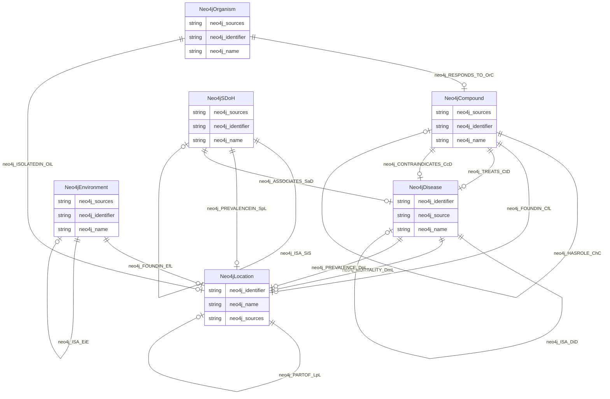

# spoke

## Schema Diagram

## Imports

* linkml:types

## Classes

| Class | Description | Occurrences |
| --- | --- | --- |
| [Neo4jCompound](https://github.com/frink-okn/graph-descriptions/blob/main/spoke-kg/classes/Neo4jCompound.md) | None | 798 | 
| [Neo4jDisease](https://github.com/frink-okn/graph-descriptions/blob/main/spoke-kg/classes/Neo4jDisease.md) | None | 180 | 
| [Neo4jEnvironment](https://github.com/frink-okn/graph-descriptions/blob/main/spoke-kg/classes/Neo4jEnvironment.md) | None | 2 | 
| [Neo4jLocation](https://github.com/frink-okn/graph-descriptions/blob/main/spoke-kg/classes/Neo4jLocation.md) | None | 106067 | 
| [Neo4jOrganism](https://github.com/frink-okn/graph-descriptions/blob/main/spoke-kg/classes/Neo4jOrganism.md) | None | 321442 | 
| [Neo4jSDoH](https://github.com/frink-okn/graph-descriptions/blob/main/spoke-kg/classes/Neo4jSDoH.md) | None | 1426 | 

## Slots

| Slot | Description | Occurrences |
| --- | --- | --- |
| [neo4j_ASSOCIATES_SaD](https://github.com/frink-okn/graph-descriptions/blob/main/spoke-kg/slots/neo4j_ASSOCIATES_SaD.md) |  | 39 |
| [neo4j_CONTRAINDICATES_CcD](https://github.com/frink-okn/graph-descriptions/blob/main/spoke-kg/slots/neo4j_CONTRAINDICATES_CcD.md) |  | 51 |
| [neo4j_FOUNDIN_CfL](https://github.com/frink-okn/graph-descriptions/blob/main/spoke-kg/slots/neo4j_FOUNDIN_CfL.md) |  | 563803 |
| [neo4j_FOUNDIN_EfL](https://github.com/frink-okn/graph-descriptions/blob/main/spoke-kg/slots/neo4j_FOUNDIN_EfL.md) |  | 11367 |
| [neo4j_HASROLE_ChC](https://github.com/frink-okn/graph-descriptions/blob/main/spoke-kg/slots/neo4j_HASROLE_ChC.md) |  | 34 |
| [neo4j_identifier](https://github.com/frink-okn/graph-descriptions/blob/main/spoke-kg/slots/neo4j_identifier.md) |  | 429915 |
| [neo4j_INTERACTS_CiC](https://github.com/frink-okn/graph-descriptions/blob/main/spoke-kg/slots/neo4j_INTERACTS_CiC.md) |  | 1 |
| [neo4j_ISA_CiC](https://github.com/frink-okn/graph-descriptions/blob/main/spoke-kg/slots/neo4j_ISA_CiC.md) |  | 56 |
| [neo4j_ISA_DiD](https://github.com/frink-okn/graph-descriptions/blob/main/spoke-kg/slots/neo4j_ISA_DiD.md) |  | 41 |
| [neo4j_ISA_EiE](https://github.com/frink-okn/graph-descriptions/blob/main/spoke-kg/slots/neo4j_ISA_EiE.md) |  | 1 |
| [neo4j_ISA_SiS](https://github.com/frink-okn/graph-descriptions/blob/main/spoke-kg/slots/neo4j_ISA_SiS.md) |  | 999 |
| [neo4j_ISOLATEDIN_OiL](https://github.com/frink-okn/graph-descriptions/blob/main/spoke-kg/slots/neo4j_ISOLATEDIN_OiL.md) |  | 321442 |
| [neo4j_MORTALITY_DmL](https://github.com/frink-okn/graph-descriptions/blob/main/spoke-kg/slots/neo4j_MORTALITY_DmL.md) |  | 10802 |
| [neo4j_name](https://github.com/frink-okn/graph-descriptions/blob/main/spoke-kg/slots/neo4j_name.md) |  | 429915 |
| [neo4j_PARTOF_CpC](https://github.com/frink-okn/graph-descriptions/blob/main/spoke-kg/slots/neo4j_PARTOF_CpC.md) |  | 18 |
| [neo4j_PARTOF_LpL](https://github.com/frink-okn/graph-descriptions/blob/main/spoke-kg/slots/neo4j_PARTOF_LpL.md) |  | 119810 |
| [neo4j_PREVALENCE_DpL](https://github.com/frink-okn/graph-descriptions/blob/main/spoke-kg/slots/neo4j_PREVALENCE_DpL.md) |  | 275085 |
| [neo4j_PREVALENCEIN_SpL](https://github.com/frink-okn/graph-descriptions/blob/main/spoke-kg/slots/neo4j_PREVALENCEIN_SpL.md) |  | 2999117 |
| [neo4j_RESEMBLES_DrD](https://github.com/frink-okn/graph-descriptions/blob/main/spoke-kg/slots/neo4j_RESEMBLES_DrD.md) |  | 67 |
| [neo4j_RESPONDS_TO_OrC](https://github.com/frink-okn/graph-descriptions/blob/main/spoke-kg/slots/neo4j_RESPONDS_TO_OrC.md) |  | 5138 |
| [neo4j_source](https://github.com/frink-okn/graph-descriptions/blob/main/spoke-kg/slots/neo4j_source.md) |  | 180 |
| [neo4j_sources](https://github.com/frink-okn/graph-descriptions/blob/main/spoke-kg/slots/neo4j_sources.md) |  | 432273 |
| [neo4j_TREATS_CtD](https://github.com/frink-okn/graph-descriptions/blob/main/spoke-kg/slots/neo4j_TREATS_CtD.md) |  | 163 |

## IRI prefixes

* linkml: https://w3id.org/linkml/
* neo4j: neo4j://graph.schema#
* okn: https://purl.org/okn/
* okns: https://purl.org/okn/schema/
* xsd: http://www.w3.org/2001/XMLSchema#
* shex: http://www.w3.org/ns/shex#
* schema: http://schema.org/
