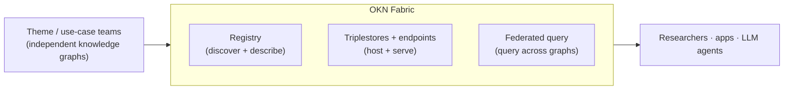
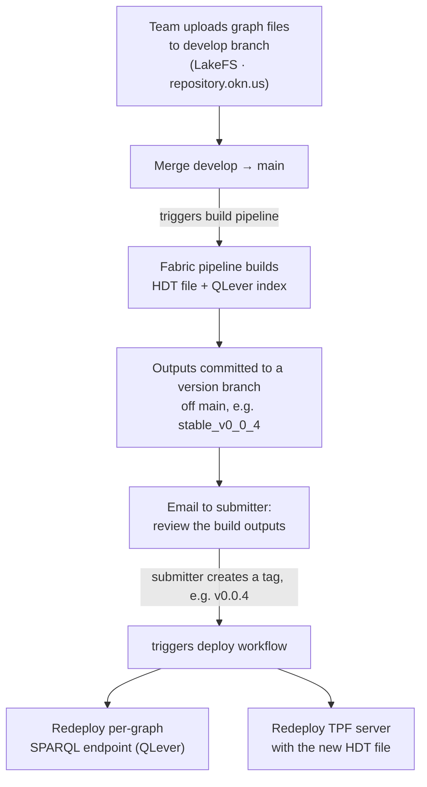
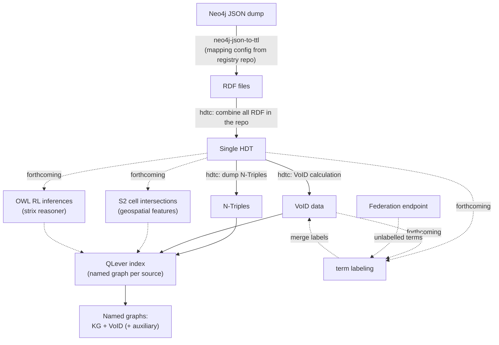
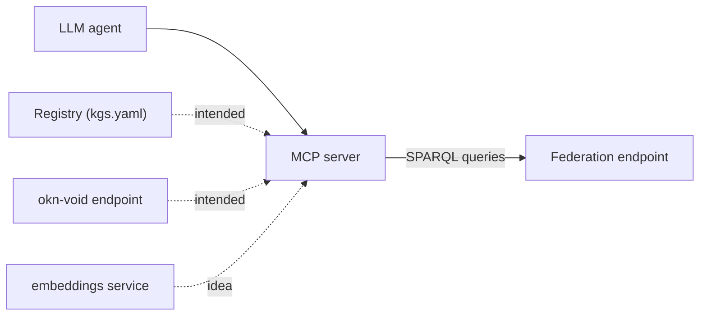
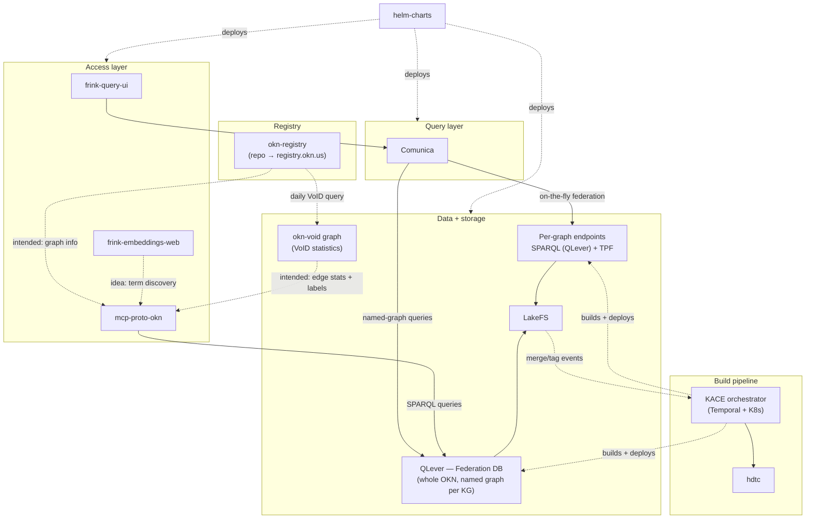

# OKN Fabric — Architecture & Resource Guide

> **Status:** Working draft. Single file for now; structured so sections can be split
> into a `docs/` tree once content stabilizes.
>
> **Callout legend:**
> - **Intended** — a connection that *should* exist by design but is **not yet wired up**.
> - **Forthcoming** — a component/step that is planned but **not yet implemented**.
> - **Idea** — a possibility under consideration, not yet committed.

The **OKN Fabric** is the technical fabric of the NSF Proto-OKN program: the
infrastructure that takes the independently developed knowledge graphs produced by the
program's theme/use-case teams and makes them **uniformly deployable, discoverable,
queryable, and federatable** as a single Open Knowledge Network.

## How to read this document

It is layered for two audiences:

- **Program / PI / newcomer** — read [What the Fabric does](#what-the-fabric-does),
  [Public resources at a glance](#public-resources-at-a-glance), and
  [Where information resides](#where-information-resides).
- **Fabric developer** — continue into [Data lifecycle](#data-lifecycle), the
  [API & endpoint reference](#api--endpoint-reference), and the
  [Component inventory](#component-inventory).

Scope is the **fabric itself**. The theme/use-case knowledge graphs appear only as data
sources; their internal modeling lives in their own documentation.

---

## What the Fabric does



The Fabric provides four core capabilities:

1. **Deployment** — a uniform way to host any contributed RDF knowledge graph.
2. **Discovery** — a registry that catalogs each graph with standard metadata.
3. **Query** — per-graph SPARQL and TPF endpoints, plus a web query UI.
4. **Integration** — federated query *across* graphs, and harmonization tooling.

## Public resources at a glance

| Resource | URL | Purpose |
|---|---|---|
| Registry | `https://registry.okn.us/registry/` | Catalog of hosted graphs + metadata |
| Hosted apps / endpoints | `https://apps.okn.us/` | SPARQL/TPF endpoints and services |
| Per-graph SPARQL | `https://apps.okn.us/{kg-name}/sparql` | Query a single graph (e.g. `spoke-okn`) |
| Query UI | `https://apps.okn.us` | Browser-based query + federation |
| MCP server | `https://apps.okn.us/okn-mcp/mcp` | LLM/agent access to the graphs |
| VoID statistics graph | `https://apps.okn.us/okn-void/sparql` | Class–predicate–class triple counts for every KG |
| Data repository | `https://repository.okn.us` | LakeFS — versioned contributed graph files |
| GitHub org | `https://github.com/frink-okn` | Source for all fabric components |

---

## Where information resides

Information in the Fabric lives in a small number of well-defined places. The domain map
is the fastest orientation:

| Host | What lives there |
|---|---|
| `okn.us` | Canonical landing / program entry point |
| `registry.okn.us` | Graph registry: metadata, descriptions, contribution flow |
| `apps.okn.us` | Running services: query UI, per-graph SPARQL/TPF endpoints, Federation endpoint, MCP, embeddings |
| `repository.okn.us` | LakeFS — versioned store of the contributed graph files (the source of truth for each graph's data) |
| `github.com/frink-okn` | All fabric source code and deployment artifacts |

Three distinct kinds of "information" and where each one is the source of truth:

- **The data itself (triples)** → contributed RDF, versioned in **LakeFS**, served as
  per-graph SPARQL (via **QLever**) and TPF, and queryable across graphs through the
  unified **Federation** triplestore.
- **Metadata about each graph** (name, description, license, endpoints, example queries) →
  the **registry**, whose source of truth is the `okn-registry` GitHub repo (per-KG
  Markdown frontmatter, recompiled into `kgs.yaml`) and rendered at `registry.okn.us`.
  Per-graph "schema" statistics come from the **`okn-void`** graph (see
  [Registry](#registry)).
- **How the fabric is built and run** → the `frink-okn` GitHub repos, with deployment in
  `helm-charts`.

## Data lifecycle

A contributed graph is versioned in **LakeFS** (`repository.okn.us`), which is git-like:
each graph is a repository with branches, merges, and tags. Publishing and deployment are
driven entirely by **LakeFS operations**, which trigger Fabric pipelines.



Step by step:

1. **Upload** — the team uploads new graph files to the **`develop`** branch of their
   LakeFS repository at `repository.okn.us`.
2. **Publish (merge → build)** — when ready, they merge **`develop` → `main`**. This kicks
   off the **Fabric build pipeline**.
3. **Build outputs** — when the pipeline finishes, both an **HDT file** and a **QLever
   index** have been built and committed to a branch off `main` named by an incremented
   version, e.g. **`stable_v0_0_4`**.
4. **Review** — the submitter receives an **email** prompting them to check the build
   outputs.
5. **Deploy (tag → deploy)** — if they want to deploy, they **create a tag** from that
   branch, e.g. **`v0.0.4`**. Tag creation initiates the Fabric **deploy workflow**, which
   redeploys their **SPARQL endpoint** and redeploys the **TPF server** with the new HDT
   file.

So there are two distinct triggers: a **merge to `main`** runs the build, and a **tag**
runs the deploy — giving the submitter a review checkpoint in between.

### Inside the build pipeline

The pipeline is orchestrated by **KACE** (Kubernetes Artifacts Creation Engine):
a FastAPI **webhook** receives LakeFS merge/tag events, which drive **Temporal** workflows
that run conversions as **Kubernetes Jobs**, write artifacts back to LakeFS, and deploy
endpoints. KACE keeps **at most one in-flight workflow per repository** and reports status
via Slack/email canaries.

```
LakeFS event → webhook (FastAPI) → Temporal workflow → K8s Job (conversion)
  → artifacts back to LakeFS → tag → deploy endpoint → LDF sync → Slack/email canary
```

**Per-KG build steps** (the merge → build stage):



1. **Neo4j conversion (conditional)** — if an uploaded data file is a **Neo4j JSON dump**,
   the `neo4j-json-to-ttl` tool runs first, using the mapping config from the registry repo,
   to generate RDF.
2. **Combine → HDT** — `hdtc` combines all uploaded RDF files in the LakeFS repo into a
   **single HDT**.
3. **VoID calculation** — a subsequent `hdtc` step computes **VoID statistics** from that
   HDT (this is what feeds the `okn-void` graph).
4. **N-Triples dump → QLever index** — `hdtc` dumps the HDT to **N-Triples**, which loads a
   **QLever index**. The index holds **two named graphs**: one for the KG, one for its VoID
   data.

The deploy stage (tag → deploy) then stands up the per-KG QLever SPARQL endpoint and syncs
the LDF aggregator (TPF) with the new HDT.

The **Federation endpoint** (the federated QLever index over all KGs) is **not** rebuilt
per deploy — that index takes **2–3 days** to build, so it is **rebuilt on a weekly
schedule**. A newly deployed graph therefore appears at its own per-KG endpoint and TPF
immediately, but is reflected in the Federation endpoint only after the next weekly rebuild.

**Forthcoming steps** (planned, not yet implemented). All are KG-dependent and take the
**single HDT** as input. The first two add **auxiliary named graphs** to the QLever index
(just like the VoID graph); the third enriches the **VoID graph** in place:

- **S2 cell intersections** for geospatial features in the graph → auxiliary named graph.
- **OWL RL inferences** via the **`strix`** reasoner → auxiliary named graph.
- **Term labeling** — takes the graph's **HDT** and **VoID file** and extracts a **label
  for each term referenced in the VoID file**, sourcing labels primarily from the HDT and
  optionally querying the **Federation endpoint** for any terms still unlabelled. The labels
  are **merged into the VoID file**, so the VoID graph carries concept labels alongside the
  edge statistics — which the **MCP server** then serves to agents (see
  [Fabric resources the MCP server uses](#fabric-resources-the-mcp-server-uses)).

> **OPEN** — whether the S2-derived geospatial data should be fed into the OWL RL reasoner
> is not yet decided.

---

## API & endpoint reference

### Per-graph SPARQL

```
https://apps.okn.us/{kg-name}/sparql
```

Standard SPARQL 1.1 over each individual graph. Each per-graph endpoint is its own
**separate QLever instance**. Example:

```bash
curl https://apps.okn.us/spoke-okn/sparql --data-urlencode \
  'query=SELECT * WHERE { ?s ?p ?o } LIMIT 10' \
  -H 'Accept: application/sparql-results+json'
```

Every hosted graph is served through **two** per-graph interfaces: a SPARQL endpoint and a
Triple Pattern Fragments (TPF) endpoint.

### Triple Pattern Fragments (TPF)

A low-cost interface that serves one triple pattern at a time. Each graph has its own TPF
endpoint under the Linked Data Fragments (`ldf`) path:

```
https://apps.okn.us/ldf/{kg-shortname}
```

All loaded KGs can be browsed at **`https://apps.okn.us/ldf/`**. A fragment is selected
with the query arguments **`subject`**, **`predicate`**, and **`object`** (any subset);
omitting all three returns the full graph, one page at a time. Each argument takes a
**full IRI** (and `object` may also be a literal) — prefixed names like `rdf:type` are not
part of the interface. Example:

```bash
curl -G https://apps.okn.us/ldf/spoke-okn \
  --data-urlencode 'predicate=http://www.w3.org/1999/02/22-rdf-syntax-ns#type' \
  -H 'Accept: application/trig'
```

Comunica can federate over a user-selected set of these endpoints (see below). TPF's role
in the overall architecture is intentionally modest today; one promising — if still
hypothetical — use is **agentic LLM sessions checking the cardinality of a triple pattern**
before pulling data down for a local join.

### Querying across graphs — two kinds of "federation"

There are two distinct ways to query across multiple graphs. They produce equivalent
results; they differ in where the work happens and how they perform.

| | **Federation endpoint** (server-side) | **On-the-fly federation** (client-side) |
|---|---|---|
| Where | One server-side QLever database | Comunica, running in the SPARQL web app |
| Mechanism | A single triplestore holding the **entire OKN**, with **one named graph per KG**; scope a query by naming graphs | Comunica federates live over a **user-selected set of TPF endpoints** |
| Performance | Best — it's one local database, no cross-service joins | Slower; bounded by the selected endpoints |
| Use when | You want cross-graph queries at scale | A user wants to ad-hoc combine a chosen set of graphs |

**The Federation endpoint** is really just **one big QLever triplestore with a named graph
for each KG** — cross-graph results come from specifying named graphs there.

**Comunica** remains the **query-submission API** in the SPARQL web app, and its on-the-fly
federation works noticeably better over TPF endpoints than over SPARQL endpoints. But for
most cross-graph needs, named graphs on the Federation endpoint are the faster path.

Per-graph SPARQL endpoints are **separate QLever instances**, distinct from the single
QLever instance backing the Federation endpoint.

Note on freshness: the Federation index takes 2–3 days to build and is **rebuilt weekly**,
so a newly deployed or updated graph is queryable at its own per-graph endpoint immediately
but only appears in the Federation endpoint after the next weekly rebuild (see
[Inside the build pipeline](#inside-the-build-pipeline)).

> **CONFIRM** — a clearer name for the "Federation" endpoint, since it is no longer
> federating (it's a unified triplestore), and its URL.

### MCP server

```
https://apps.okn.us/okn-mcp/mcp
```

Model Context Protocol server exposing the hosted graphs to LLM agents. It executes queries
against the **Federation endpoint** (the unified QLever DB), so agents reach all graphs
through a single SPARQL service. Source: `frink-okn/mcp-proto-okn`.

#### Fabric resources the MCP server uses

Beyond running queries, the MCP server needs to *describe* the graphs to an agent and help
it form queries. Each kind of information has a Fabric resource that is its proper source of
truth:

| What the MCP needs | Source of truth |
|---|---|
| Graph information (what graphs exist, what they cover) | the **registry** (`kgs.yaml`) |
| Edge statistics (which class–predicate–class triples exist, with counts) | the **VoID endpoint** (`okn-void`) |
| Concept labels for the terms in those statistics | the **VoID graph** (labels merged in — see below) |
| Term discovery (semantic lookup) | the **embeddings service** (_idea_ — see [Embeddings](#embeddings)) |
| Query execution | the **Federation endpoint** |



> **Intended (not yet wired up).** Today the MCP build effectively **generates its own
> registry** of graph information rather than reading the central one. The target is for it
> to obtain **graph information from the registry** and **edge statistics (with concept
> labels) from the VoID endpoint**, so each kind of information has a single source of
> truth. Capturing these intended connections was a primary motivation for this document.

### Registry

The registry site at `https://registry.okn.us` is **generated from a GitHub repo**,
[`frink-okn/okn-registry`](https://github.com/frink-okn/okn-registry). **The repo is the
source of truth**; the website is the rendered view.

Per-KG metadata is authored as **one Markdown file per graph** under
`docs/registry/kgs/`, with the metadata held in each file's **YAML frontmatter**.
Alongside its metadata, a KG can contribute:

- **Example SPARQL queries** — in `docs/registry/queries/`
- **Neo4j→RDF config** — in `docs/registry/neo4j-conf/`, for teams using the
  [`neo4j-json-to-ttl`](https://github.com/frink-okn/neo4j-json-to-ttl) conversion tool

When any KG Markdown changes, the combined catalog
[`docs/registry/kgs.yaml`](https://github.com/frink-okn/okn-registry/blob/main/docs/registry/kgs.yaml)
is **recompiled from all the frontmatter sections** — this is the single machine-readable
metadata file for all graphs. A shared
[`prefixes.yaml`](https://github.com/frink-okn/okn-registry/blob/main/docs/registry/prefixes.yaml)
defines recommended namespace prefixes used in parts of the site rendering.

#### Metadata fields (frontmatter)

The fields currently used per graph:

| Field | Holds |
|---|---|
| `title` | Display name |
| `shortname` | Identifier (matches the endpoint path, e.g. `spoke-okn`) |
| `description` | Free-text description |
| `homepage` | Project website URL |
| `license` | License URL |
| `funding` | Funding-award URL (or null) |
| `contact` / `contacts` | One contact, or an array — each with `email`, `github`, `label` |
| `sparql` | SPARQL endpoint URL |
| `tpf` | TPF endpoint URL |
| `stats` | Statistics endpoint URL |
| `template` | HTML template reference (rendering) |
| `frink-options` | Nested config: `lakefs-repo`, `documentation-path`, `neo4j-conversion-config-path` (optional) |

> **CONFIRM** — this schema is **not currently enforced** (it should be). The table above
> reflects observed usage in `kgs.yaml`, not a validated spec; treat fields as conventional
> until a schema/validation is added.

**Schema info (VoID).** A **daily GitHub Action** repopulates the "schema" section shown on
each rendered KG page by querying the **`okn-void` graph**. That graph is built from VoID
statistics computed per graph during the ingest pipeline, and is itself a reusable OKN
resource: it gives **counts of every "kind" of triple** in each graph — i.e.
class–predicate–class combinations. It is itself a registered graph, with a SPARQL endpoint
at `https://apps.okn.us/okn-void/sparql` and TPF at `https://apps.okn.us/ldf/okn-void`.

**Coupling to the build pipeline.** The registry is otherwise **decoupled** from the KACE
build/deploy pipeline — metadata is contributor-maintained in the repo. This daily VoID
refresh is the **only** link from the pipeline to the registry; a build/deploy does not
otherwise write back to the registry.

> **Idea (not yet implemented):** surface each graph's **currently deployed version** in
> the registry, plausibly via the same daily-action mechanism.

| Item | Location |
|---|---|
| Source-of-truth repo | `github.com/frink-okn/okn-registry` |
| Per-KG metadata (frontmatter) | `docs/registry/kgs/` |
| Example SPARQL queries | `docs/registry/queries/` |
| Neo4j→RDF config | `docs/registry/neo4j-conf/` |
| Compiled catalog (machine-readable) | `docs/registry/kgs.yaml` |
| Recommended prefixes | `docs/registry/prefixes.yaml` |
| Rendered site | `registry.okn.us` |

### Embeddings

`frink-embeddings-web` serves embeddings derived from the OKN graphs, backed by a **Qdrant**
vector database. It is **not heavily used yet**, and its role in the overall architecture is
still taking shape. Base path: `https://apps.okn.us/embeddings/`.

**Interactive UI** — `GET /embeddings/` with query parameters:

| Param | Meaning |
|---|---|
| `type` | Feature type (`Text` / `Node`) |
| `value` | The text or node to search for |
| `graph-mode` | `include` or `exclude` |
| `graph` | Graph shortname to include/exclude (repeatable) |

e.g. `https://apps.okn.us/embeddings/?type=text&value=brains`

**JSON API** — `POST /embeddings/query` with a body matching the `Query` model:

```bash
curl -X POST https://apps.okn.us/embeddings/query \
  -H 'Content-Type: application/json' \
  -d '{
        "feature": { "type": "text", "value": "brains" },
        "include_graphs": ["spoke-okn"],
        "limit": 10,
        "offset": 0
      }'
```

`feature` is a discriminated union on `type` — `text` or `node` (with a `value`).
`include_graphs` / `exclude_graphs` are optional lists (only one may be set); `limit`
defaults to 10, `offset` to 0. The response is JSON with a `results` array of scored
nearest matches.

> **Idea.** The **MCP server** could use this service for **term discovery** — semantic
> ("fuzzy") lookup of relevant terms from a natural-language request — to complement the
> exact-match graph info and edge statistics it gets from the registry and the VoID graph.
> Not yet wired up.

> **CONFIRM** — the gateway path mapping (this assumes `/embeddings/*` proxies to the app
> root, so the in-app `POST /query` is reached as `/embeddings/query`).

---

## Component inventory

Source components in the [`frink-okn`](https://github.com/frink-okn) org, grouped by role:

| Layer | Component | Role |
|---|---|---|
| Access | `frink-query-ui` | Web interface for querying graphs |
| Access | `mcp-proto-okn` | MCP server for LLM/agent access |
| Access | `frink-embeddings-web` | HTTP endpoint to explore graph embeddings |
| Query | `comunica` | Query-submission API in the web app; on-the-fly federation over TPF |
| Storage | QLever | Server-side SPARQL engine: per-graph endpoints + the unified Federation DB |
| Storage | TPF servers | Per-graph Triple Pattern Fragments endpoints |
| Storage | LakeFS | Versioned data lake (contributed graph files); `lakefs-acl-server` manages auth to it |
| Pipeline | `kace` | Build/deploy orchestrator (Temporal + K8s), driven by LakeFS events |
| Pipeline | `hdtc` | HDT creator (compressed RDF); also computes VoID statistics (feeds the `okn-void` graph) |
| Registry | `okn-registry` | Source-of-truth repo for graph metadata; renders `registry.okn.us` |
| Data | `okn-void` graph | VoID statistics graph: class–predicate–class triple counts per KG |
| Contributor tooling | `neo4j-json-to-ttl` | Neo4j JSON → Turtle conversion for contributing teams |
| Reasoning | `strix` | OWL RL reasoner — _forthcoming_ pipeline step (auxiliary inference graph) |
| Ops | `helm-charts` | Kubernetes deployment artifacts |



---

## Open questions / TODO

- [ ] _Idea:_ display each graph's currently deployed **version** in the registry (likely
      via the daily VoID-refresh action).
- [ ] **Wire the MCP server to the registry and VoID endpoint** — replace its self-generated
      registry with graph info from the registry and edge stats from `okn-void`.
- [ ] Land the **forthcoming pipeline steps** (S2 cell intersections; `strix` OWL RL
      inference; **term labeling** → merge concept labels into the VoID file) and decide
      whether S2 output feeds the reasoner.
- [ ] **Define and enforce** the registry frontmatter **metadata schema** (currently
      documented from observed usage, not validated).
- [ ] **Rename the "Federation" endpoint** — it is now a unified QLever triplestore, not a
      federation. Pick a name and update the doc.
- [ ] Decide the split point: when this file grows, break into
      `docs/{architecture,endpoints,registry,contributing}.md` with this as the index.

## References

- OKN Registry — https://registry.okn.us/
- Registry repo (`okn-registry`) — https://github.com/frink-okn/okn-registry
- Per-KG metadata (`kgs/`) — https://github.com/frink-okn/okn-registry/tree/main/docs/registry/kgs
- Compiled catalog (`kgs.yaml`) — https://github.com/frink-okn/okn-registry/blob/main/docs/registry/kgs.yaml
- Recommended prefixes (`prefixes.yaml`) — https://github.com/frink-okn/okn-registry/blob/main/docs/registry/prefixes.yaml
- Neo4j→RDF tool (`neo4j-json-to-ttl`) — https://github.com/frink-okn/neo4j-json-to-ttl
- Build orchestrator (`kace`) — https://github.com/frink-okn/kace
- HDT/VoID tool (`hdtc`) — https://github.com/frink-okn/hdtc
- MCP server (`mcp-proto-okn`) — https://github.com/frink-okn/mcp-proto-okn
- `frink-okn` GitHub org — https://github.com/frink-okn
