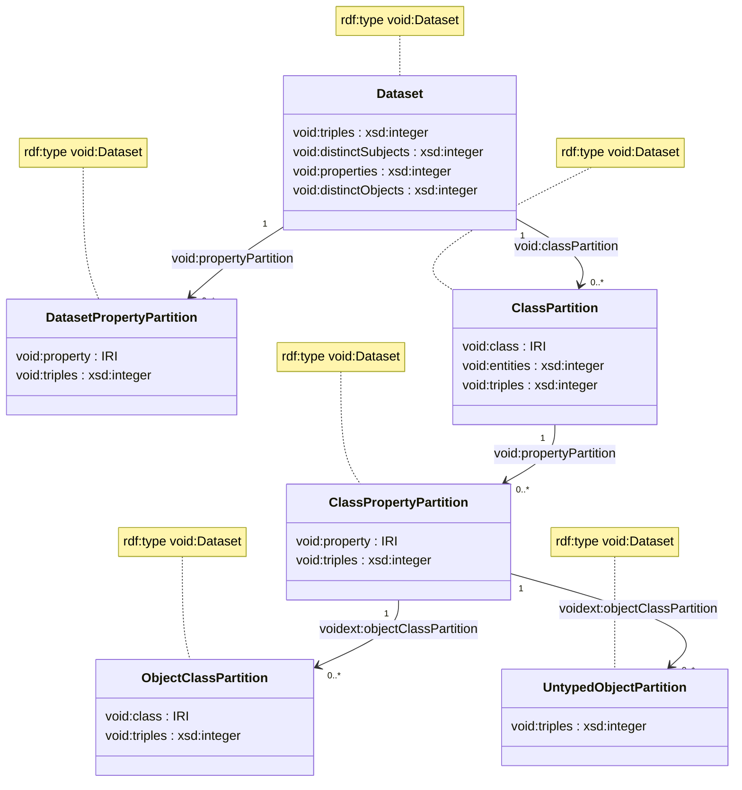

This is a meta-graph collecting descriptive data for all the graphs that are part of the Proto-OKN. 
Information about the kinds of classes and properties, and the number of triples used for each, 
is stored using the [VoID (Vocabulary of Interlinked Datasets) vocabulary](https://www.w3.org/TR/void/), 
as well as others such as the [VoID Extensions vocabulary](http://ldf.fi/void-ext).

